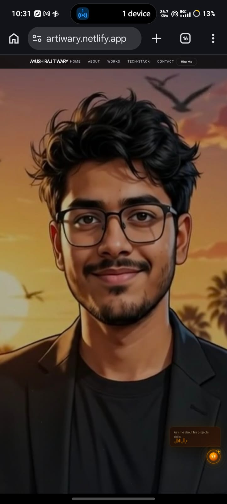

# Week 04 Assignment: Empty but Live

> **Status:** Live & Verified  
> **Track:** Full-Stack Web Development  

---

## 🚀 Submission Details

* **Live URL:** https://artiwary.netlify.app/
* **Tech Stack:** React.js (Frontend) + Node.js (Backend)
* **Hosting Platform:** Netlify

---

## ✅ Pass Criteria Checklist

- [x] **Reachable URL:** Live site is publicly accessible on the web.
- [x] **Mobile Proof:** Opened and verified on a mobile device outside local host.
- [x] **Stack Match:** Aligned with chosen React.js + Node.js stack.
- [x] **Claude Project Knowledge:** Identity kit, case studies, and content map loaded into Claude Project for build week.

---

## 📱 Mobile Verification Proof

