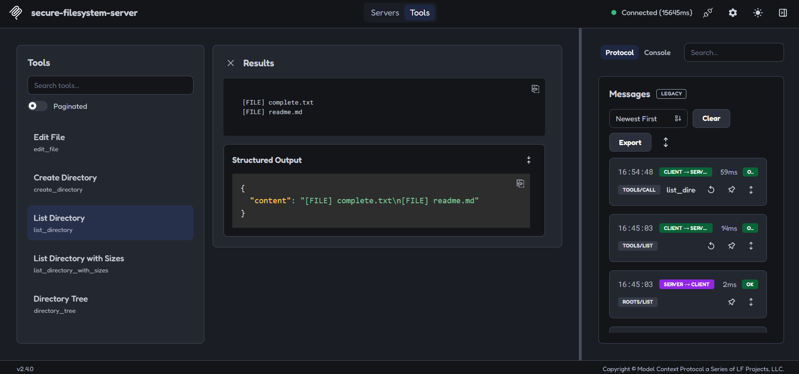
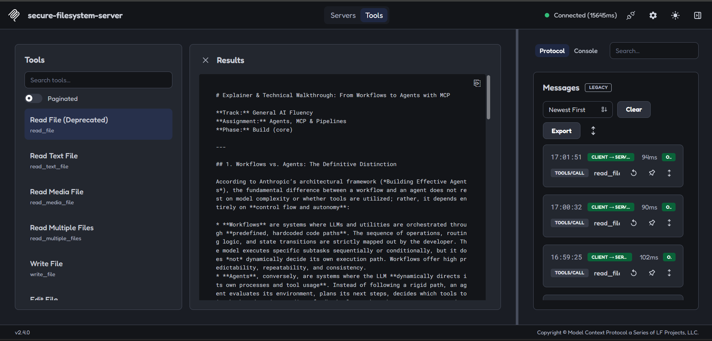
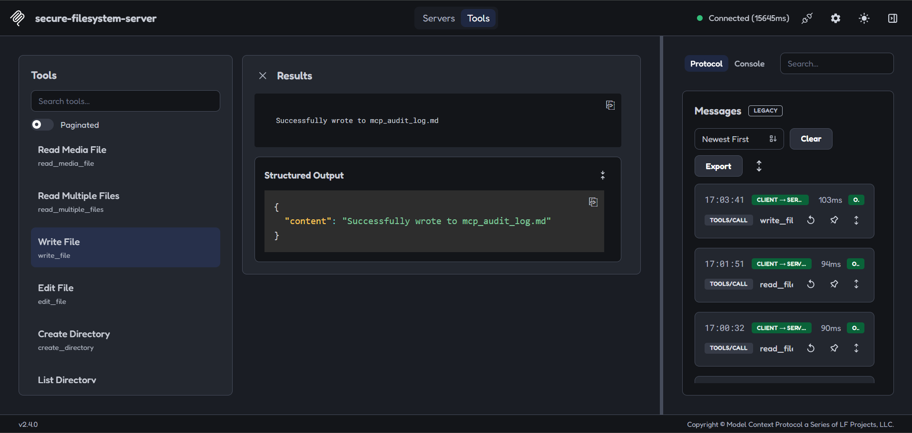

# Explainer & Technical Walkthrough: From Workflows to Agents with MCP

**Track:** General AI Fluency  
**Assignment:** Agents, MCP & Pipelines  
**Phase:** Build (core)  

---

## 1. Workflows vs. Agents: The Definitive Distinction

According to Anthropic’s architectural framework (*Building Effective Agents*), the fundamental difference between a workflow and an agent lies in **control complexity and execution autonomy**. 

* **Workflows** are systems where LLMs and utilities are orchestrated through **predefined, hardcoded code paths**. The sequence of operations, routing logic, and state transitions are strictly mapped out by the developer. The model executes specific subtasks sequentially or conditionally, but it does *not* dynamically decide its own execution path. Workflows offer high predictability, repeatability, and consistency.
* **Agents**, conversely, are systems where the LLM **dynamically directs its own processes and tool usage**. Instead of following a rigid path, an agent evaluates its environment, plans its next steps, decides which tools to invoke based on intermediate results, and dynamically loops until it determines the task is complete. Agents provide massive flexibility and adaptability for open-ended problems, though they require robust guardrails to prevent infinite loops or unintended tool executions.

---

## 2. Model Context Protocol (MCP) and Client-Server Decoupling

The **Model Context Protocol (MCP)**, pioneered by Anthropic, is an open standard that decouples AI models (Clients) from data sources and execution environments (Servers). 

### Architectural Breakdown
* **MCP Client:** The host application (such as Claude Desktop or the MCP Inspector developer interface) that holds the active LLM session and orchestrates context.
* **MCP Server:** A lightweight, modular microservice that exposes specific capabilities—such as database query execution, file system read/write operations, or API integrations—via a standardized protocol.
* **The Decoupling Value Proposition:** Before MCP, connecting every LLM client to a custom database or file system required building custom, brittle integrations for every single model provider or app. MCP standardizes the communication layer. This allows any MCP-compliant client to instantly discover, authenticate with, and leverage any MCP server without modifying the core model or host application codebase. It shifts architecture from monolithic integrations to a plug-and-play ecosystem.

---

## 3. Local MCP Implementation & Execution Proof

To demonstrate functional competence with MCP, a local **Secure Filesystem MCP Server** was initialized via `npx` and tested using the official `@modelcontextprotocol/inspector` developer dashboard. Three fundamental file operations (`list_directory`, `read_file`, and `write_file`) were executed to prove live local tool execution.

### 📸 MCP Execution Proof (Screenshots)

**1. Listing Directory (`list_directory`):**

**2. Reading Local File (`read_file`):**

**3. Writing Local Artifact (`write_file` / `mcp_audit`):**
