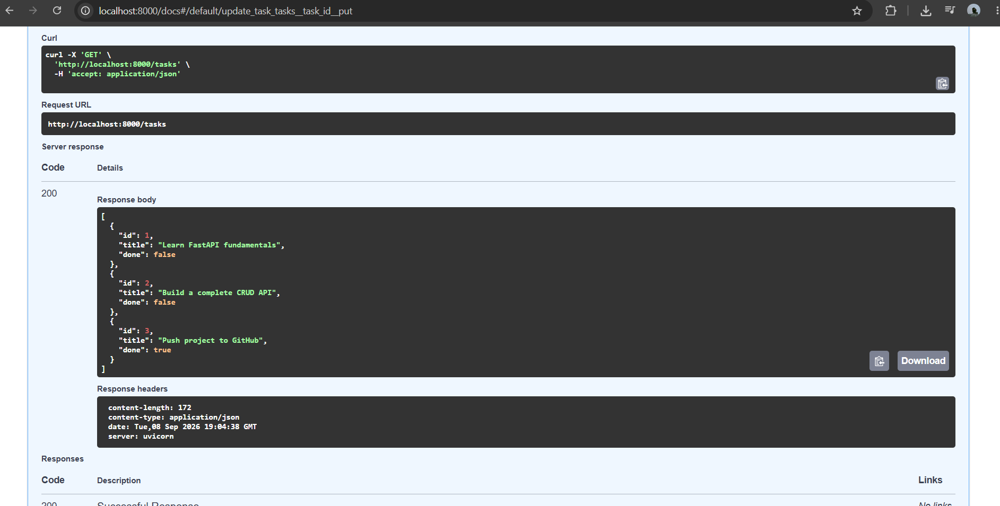

# Task CRUD API — Week 2 Assignment

A lightweight, in-memory RESTful API built with **FastAPI** that manages a standard to-do list using full CRUD operations. Developed as part of the Backend AI Engineering track.

## Project Overview

This assignment covers building a backend service from scratch, implementing the request-response loop, handling appropriate status codes (`200`, `201`, `204`, `400`, `404`), validating input payloads, and exposing interactive documentation via Swagger UI.

---

## How to Install & Run

1. **Navigate to the project folder:**
   ```bash
   cd "Backend AI/week 2"
   ```

2. **Install dependencies:**
   ```bash
   pip install fastapi uvicorn pydantic
   ```

3. **Start the development server:**
   ```bash
   uvicorn main:app --reload
   ```

The server will start at `http://localhost:8000`.

---

## Endpoints Table

| Method | Path | Description | Status Codes |
| :--- | :--- | :--- | :--- |
| **GET** | `/` | API description and metadata | `200` |
| **GET** | `/health` | Server health check endpoint | `200` |
| **GET** | `/tasks` | List all tasks currently in memory | `200` |
| **GET** | `/tasks/{task_id}` | Retrieve a specific task by its ID | `200`, `404` |
| **POST** | `/tasks` | Create a new task (validates title) | `201`, `400` |
| **PUT** | `/tasks/{task_id}` | Update an existing task by ID | `200`, `400`, `404` |
| **DELETE** | `/tasks/{task_id}` | Remove a task by ID | `204`, `404` |

---

## Example `curl` Output

```bash
$ curl -i http://localhost:8000/tasks/1
HTTP/1.1 200 OK
content-type: application/json
date: Tue, 08 Sep 2026 19:04:38 GMT
server: uvicorn
content-length: 61

{"id":1,"title":"Learn FastAPI fundamentals","done":false}
```

---

## Swagger UI Documentation

FastAPI provides built-in, interactive API documentation out of the box using Swagger UI. Once the server is running, visit:

👉 **[http://localhost:8000/docs](http://localhost:8000/docs)**

### Swagger UI Verification Screenshot
