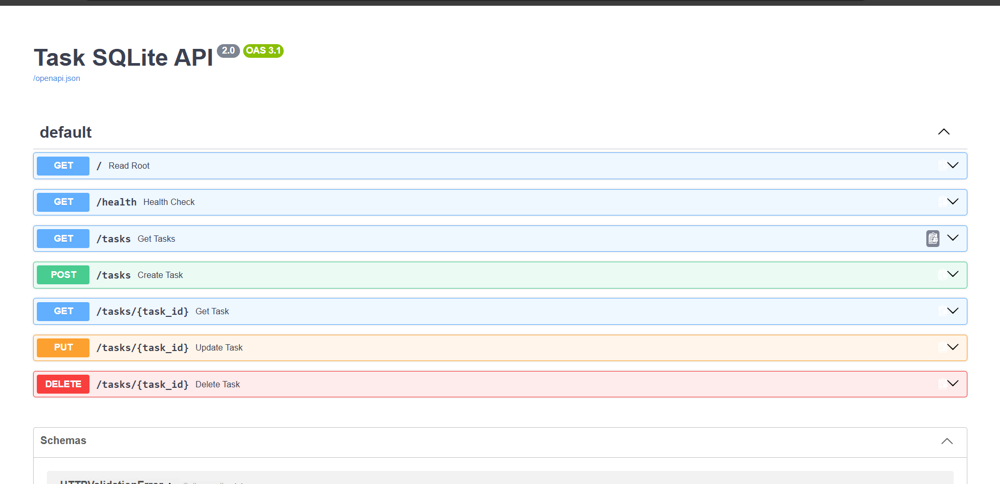

---

## Example `curl` Output

```bash
$ curl.exe -i http://localhost:8000/tasks
HTTP/1.1 200 OK
date: Tue, 08 Sep 2026 19:30:45 GMT
server: uvicorn
content-length: 172
content-type: application/json

[{"id":1,"title":"Learn FastAPI fundamentals","done":false},{"id":2,"title":"Build a complete CRUD API","done":false},{"id":3,"title":"Push project to GitHub","done":true}]
```

---

## Example Executed SQL Query
During Stage 4 exploration using a SQLite viewer, the following query was run to filter completed tasks directly from the database file:
```sql
SELECT * FROM tasks WHERE done = 1;
```

---

## Database Viewer & Swagger UI Documentation

- **Interactive Documentation:** Visit `http://localhost:8000/docs` while the server is running to test the API through Swagger UI.
- **Database Viewer Screenshot:**
